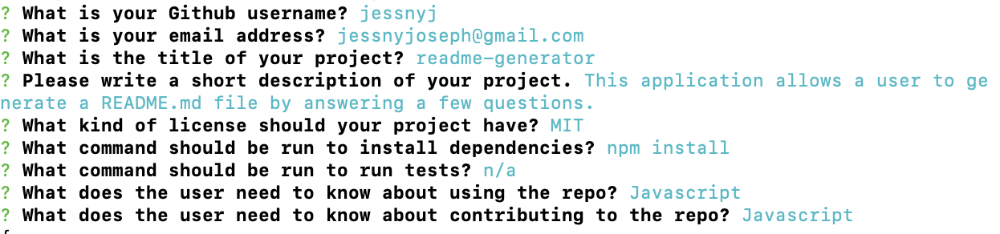

# readme-generator

 

## Table of Contents
* [Title](#title)
* [Demo](#demo)
* [Technologies Used](#technologies-used)
* [Description](#description)
* [Work Involved](#work-involved)
* [Code Snippet](#code-snippet)
* [Usage](#usage)
* [License](#license)
* [Authors](#authors)
* [Questions](#questions)
* [Acknowledgments](#acknowledgments)

## Demo


## Technologies Used
* javascript
* NodeJS

## Description
This command-line application allows a user to dynamically generate a README.md file by answering a few questions. Within the professional READ.md file, the sections include the title, description, table of contents, installation, usage, license, contributing, tests, and questions.

## Work Involved
For this application, it was necessary to install inquirer. I developed a list of prompt questions for the user to answer, in which I added those answers to a README template so that the desired file could be generated. 

## Code Snippet
```
const promptUser = () => {
    return inquirer.prompt([
        {
            type: 'input',
            name: 'username',
            message: 'What is your Github username?',
        },
        {
            type: 'input',
            name: 'email',
            message: 'What is your email address?',
        },
```

## Usage


## License
This project is covered under MIT.

## Authors
**UC Berkeley Coding Bootcamp**
**Jessny Joseph** 

## Questions 
* [Github](https://github.com/jessnyj)
* [LinkedIn](https://www.linkedin.com/in/jessny-joseph-361515201)

## Acknowledgments
Trilogy Education Services